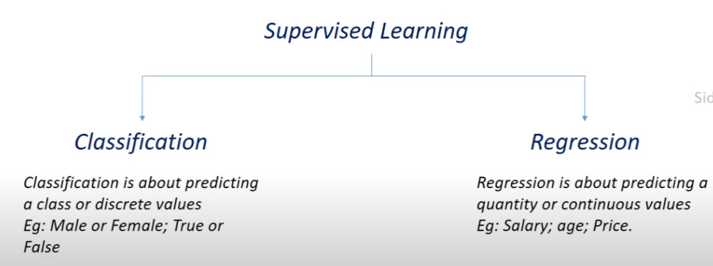

# 30Days30Projects
 ##By - Ashish Kumar

 Day 1: Rock vs. Mine prediction using Logistic Regression model and Feature importance visualization. [Classification problem] 
 Day 2: Diabetes prediction using Support Vector Classifier model and Feature importance visualization and plotting various visualizations. [Classification problem]  
 Day 3: Boston House Price prediction using XGBoost Regressor model and Feature importance visualization using PyPlot and XGBoost. [Regression problem]  

